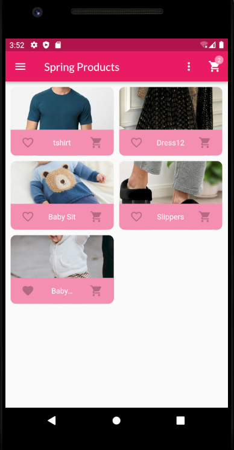
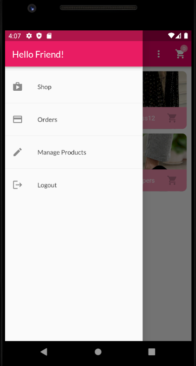
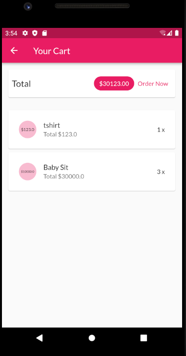
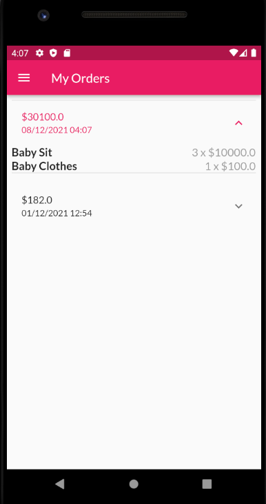
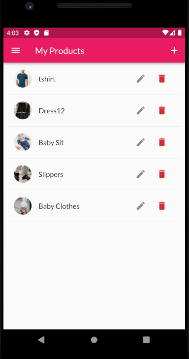
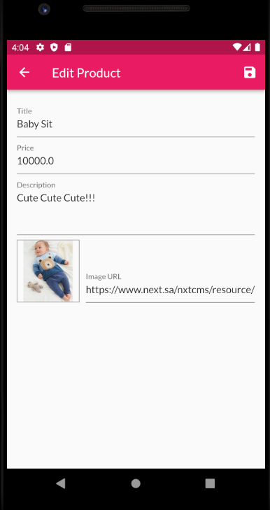

## 🎯 E-commerce App "Spring"
It's a simple eCommerce "Shop" Application developed using Flutter-Firebase. It has the feature of adding products to the app by many different sellers "Basically, the users are the sellers".

## ⚙ Tools Used
- Flutter
- Firebase

## ✨ Features
✔ User Authenticatin "SignUp, SignIn" with auto-logoIn and other related services\
✔ Add and edit your products\
✔ View products added by other users\
✔ Maintain cart\
✔ Make products as favourite\
✔ Review your orders\
✔ Connect with Firebase and store data as a RealTime data

## 🎬 Illustration

Here are some Illustration of App Screens

|   |     |
| :--------------------------------: | :---------------------------------------: |
|       Authentication Screen        |        Product Overview Screen            |

|  |            |
| :--------------------------------: | :---------------------------------------: |
|       Product Details Screen       |            Home Screen Drawer             |

|          |               |
| :--------------------------------: | :---------------------------------------: |
|            Cart Screen             |              Orders Screen                |

|    |        |
| :--------------------------------: | :---------------------------------------: |
|       Manage Products Screen       |            Edit Product Screen            |

## 💣Installation
- Clone the repo
- Setup Firebase
- Serach for TODO inside providers files: Product, Products, Orders, Auth 
- Replace each ... with the required link

## ❤ THANKS!
Thank you for using this repo and please contact me for any support or collaboration E-mail: Ashwaqazan@gmail.com.
